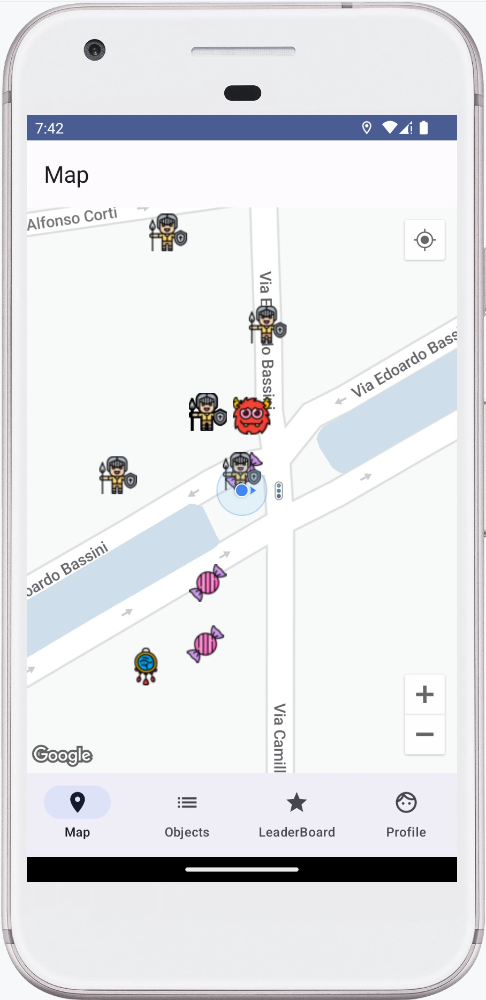
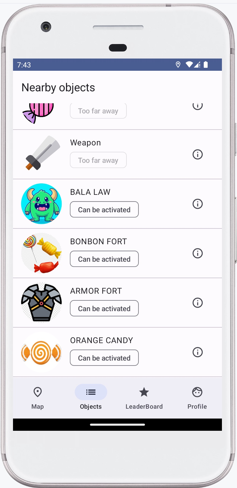
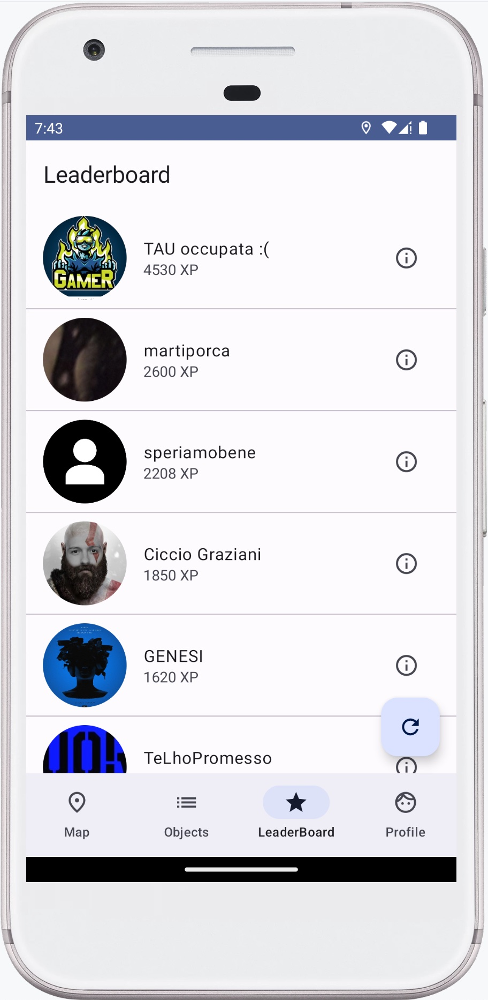
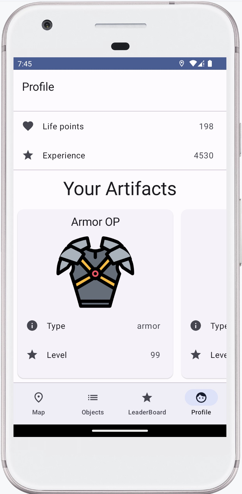
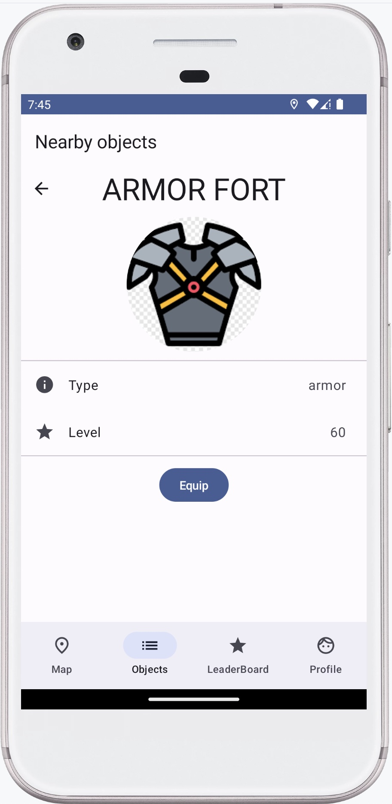

Scopo del progetto è la realizzazione di un prototipo di client per un gioco online georeferenziato. Nel gioco, alcuni mostri (ovviamente virtuali) sono distribuiti in coordinate geografiche corrispondenti al mondo reale. Ogni giocatore si deve spostare nel mondo reale, trovare dei mostri e sconfiggerli. Nel combattere contro i mostri, l'utente perde dei punti vita. L'utente può guadagnare punti vita trovando delle caramelle virtuali, posizionate in coordinate geografiche del mondo reale. Alcuni oggetti virtuali, chiamati artefatti, sparsi per il mondo, potenziano il giocatore. Ogni volta che un utente sconfigge un mostro, guadagna punti esperienza. Una classifica mostra chi ha più punti esperienza, tra gli utenti in gioco. Ogni volta che un mostro viene sconfitto, sparisce e il server ne crea uno identico in un'altra posizione della mappa. Il funzionamento è analogo per le caramelle e gli artefatti.

## Screenshot

